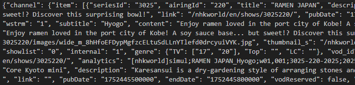
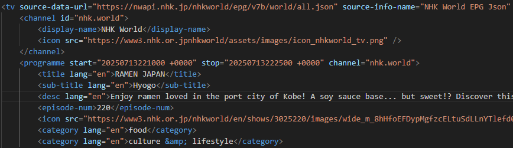

# NHK EPG to XMLTV converter

Forked from Squizzy's original python script and updated to work with NHK World Japan's updated EPG API.
I've also added command line arguments to replace some of the hard coded values, like output file name/location,
number of days of EPG to retrieve, and switches to enable debug mode.

## From



## To


  
## The applications

- __`CreateNHKXMLTV.py`__

    Extracts NHK's EPG in JSON from its website  
    Converts it to an XMLTV file  
    Saves the XMLTV to a text file specified with the -o argument.

## How to run the application which converts the EPG to XMLTV: `CreateNHKXMLTV`

### Python3

Currently hosted only in the __master__ branch of this github repository.  
Two files are needed: CreateNHKXMLTV.py and requirements.txt.

1. In a terminal, create a dedicated folder

    Open a console:

    > Windows, run Command Prompt (cmd.exe) or Powershell (powershell.exe)
    > MacOS: run Terminal (Terminal.app)
    > Linux: run Terminal (Terminal)

    Navigate to your preferred location then create the folder, e.g.:

    ```shell
    mkdir NHK-World-EPG-XMLTV-Extractor
    ```  

    ```shell
    cd NHK-World-EPG-XMLTV-Extractor
    ```

2. Download the required files from the repository

    - Either direct from here (place the files in the folder created earlier):
    > [CreateNHKXMLTV.py](https://github.com/solidsnake1298/NHK-World-EPG-to-XMLTV/blob/master/Python/CreateNHKXMLTV.py)  
    > [requirements.txt](https://github.com/solidsnake1298/NHK-World-EPG-to-XMLTV/blob/master/Python/requirements.txt)

    - or from the terminal:  

    ```shell
    curl -O https://raw.githubusercontent.com/solidsnake1298/NHK-World-EPG-to-XMLTV/refs/heads/master/Python/CreateNHKXMLTV.py
    ```

    ```shell
    curl -O https://raw.githubusercontent.com/solidsnake1298/NHK-World-EPG-to-XMLTV/refs/heads/master/Python/requirements.txt
    ```

3. Set up the environment:

    1. From the terminal in the folder created earlier, create a virtual environment in the folder (so all needed modules are isolated locally):

        ```shell
        python3 -m venv venv
        ```

    2. Load the environment:

        - For Windows:

        ```shell
        .\venv\Scripts\activate
        ```

        - For MacOS, Linux:

        ```shell
        source venv/bin/activate
        ```

    3. Load the required modules (Windows, MacOs, Linux):

        ```shell
        pip install -r requirements.txt
        ```

    This is now ready to run.

4. Launch

    ```shell
    python CreateNHKXMLTV.py -d 14 -o OutputFile.xml
    ```

5. The XMLTV is saved in the file/path you provided with the -o option.

Should run on Windows, Mac, and Linux.  I've only tested on Linux.

## Arguments

    > -d <int>          # Provide an integer value between 1 and 14 to grab that many days of EPG
    > -o <file path>    # Provide a path and file name for the XMLTV output file
    > --debug           # Enables debugging/testing without pulling from NHK.  Requires a JSON file provided by --debugFile FILENAME (see below)
    > --debugFile <json filename>

## Background info

NHK World is a Japanese television channel that broadcasts a wide range of programming, including news, sports, and entertainment.
This is information that was collected from different sources.

## Version history

### CreateNHKXMLTV.py

20251031 - v2.0
    - Added CLI arguments to replace hard coded values.
    - Removed genre related artifacts.  NHKW does not appear to use them in their EPG anymore.

20251029 - v1.6
    - Updated to work with new NHK World Japan EPG API.

20250715 - v1.5
    - Error checking on NHK URL access added for feedback
    - Progress feedback of application execution
    - Changed to GPLv2 license

20250715 - v1.4
    - Merged refactored Python3 version of CreateNHKXMLTV.py into master branch.
    - Corrected requirement.txt -> requirements.txt .

20240502 - v1.3
    - Version change to represent the refactored Python3 version of CreateNHKXMLTV.py in its devel branch.

20240415 - v1.2
    - Updated the URL for the NHK world EPG JSON as per external contributor fxbx recommendation
    - Replaced deprecated utcfromtimestamp(), added timeOffsetVariable
    - Cleaned up XML tree generation
    - Added some new genres

20190120 - v1.1
    - Changed to pulling the file from URL
    - Windows executable created using "auto-py-to-exe.exe .\CreateNHKXMLTV.py" (auto-pi-to-exe v2.5.1)\
      File to be found under "output" folder. Not virus checked.

20190119 - v1.0.5
    - Added second category (genre) for channels which have it

20190119 - v1.0.4
    - Corrected \<category\> (genre) to use all lowercase

20190119 - v1.0.3
    - Corrected \<Icon\> typo source xml

20190119 - v1.0.2
    - Added header, version, licence, and reference URL for later

19 Jan 2019 - v1.0.1
    - Some tidying up

20190119 - v1.0
    - First release as working version

### scrape_nhk_genres.py  (removed)

20251031 - v2.0
    - Removed

20250715 - v1.2
    - Error checking on NHK URL access added for feedback
    - Refactored for clarity
    - Changed to GPLv2

20250715 - v1.1
    - Merged from development branch into master branch.

20240921 - v1.0
    - First release as a working version
